# 🧠 Head CT — Beyin BT'de Kanama Tespiti

> Beyin BT (bilgisayarlı tomografi) kesitlerinden **intrakraniyal kanamayı** otomatik olarak tespit eden, uçtan uca derin öğrenme tabanlı bir karar destek sistemi. Hem araştırma (model eğitimi/değerlendirme) hem uygulama (masaüstü arayüz) tarafını içerir.

<p align="center">
  
  
  
  
  
  
</p>

---

## 📌 Kısa Özet

| | |
|---|---|
| **Problem** | Binary (ikili) sınıflandırma — `Normal (0)` vs `Hemorrhage (1)` |
| **Veri seti** | [Kaggle — Head CT Hemorrhage](https://www.kaggle.com/datasets/felipekitamura/head-ct-hemorrhage) (200 görüntü, dengeli) |
| **Modeller** | ConvNeXt‑Tiny (transfer learning) ve Custom CNN (sıfırdan) |
| **En iyi sonuç** | **Accuracy %96.7 · Recall %93.3 · Precision %100** (ConvNeXt‑Tiny) |
| **Açıklanabilirlik** | Grad‑CAM ısı haritası + kırmızı bounding box |
| **Arayüz** | CustomTkinter ile modern masaüstü dashboard |

> ⚠️ **Önemli:** Bu çalışma araştırma ve eğitim amaçlıdır, klinik tanı yerine geçmez.

---

## 🗂️ İçindekiler

1. [Proje Amacı](#-proje-amacı)
2. [Sistem Mimarisi](#-sistem-mimarisi)
3. [Veri Seti](#-veri-seti)
4. [Veri Hazırlama ve Leakage Önleme](#-veri-hazırlama-ve-leakage-önleme)
5. [Augmentation Stratejisi](#-augmentation-stratejisi)
6. [Model Mimarileri](#-model-mimarileri)
7. [Eğitim Stratejisi](#-eğitim-stratejisi)
8. [Sonuçlar ve Karşılaştırma](#-sonuçlar-ve-karşılaştırma)
9. [Grafiksel Arayüz (GUI)](#-grafiksel-arayüz-gui)
10. [Kurulum ve Kullanım](#-kurulum-ve-kullanım)
11. [Sınırlamalar](#-sınırlamalar)
12. [Sonuç](#-sonuç)
13. [Yazarlar](#-yazarlar)
14. [Kaynakça](#-kaynakça)

---

## 🎯 Proje Amacı

İntrakraniyal kanamalar, mortalite ve morbidite açısından kritik nörolojik acillerden biridir. Acil servislerde BT görüntüleme, hızlı erişilebilirliği ve kanamaya karşı duyarlılığı sayesinde birinci basamak tanı yöntemidir. Ancak yoğun vaka yükü, vardiya saatleri ve gözlemciler arası tutarsızlıklar; ön değerlendirmelerde hata veya gecikme riskini artırabilir.

Bu projede amacımız:

- BT kesitinden **kanama var/yok** sorusuna otomatik yanıt veren bir sistem kurmak,
- Aynı veri pipeline'ı üzerinde **transfer learning** ve **sıfırdan öğrenme** yaklaşımlarını karşılaştırmak,
- **Grad-CAM** ile modelin "neye baktığını" görselleştirerek açıklanabilir bir prototip sunmak,
- Tüm akışı modern bir **masaüstü arayüzle** son kullanıcıya açmak.

Çalışma yalnızca model eğitimiyle sınırlı değil; veri okuma → ayırma → augmentation → eğitim → değerlendirme → açıklama → arayüz şeklinde **uçtan uca** kurgulandı.

---

## 🏗️ Sistem Mimarisi

CT kesitinin yüklenmesinden GUI çıktısına kadar tüm boru hattı:

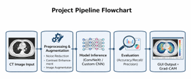

**Akışın ana adımları:**

1. **CT Image Input** — `head_ct/` klasöründen görüntü okuma
2. **Preprocessing & Augmentation** — gürültü azaltma, kontrast iyileştirme, augmentation
3. **Model (ConvNeXt / Custom CNN)** — sınıflandırma
4. **Evaluation** — Accuracy / Recall / Precision + Confusion Matrix
5. **GUI Output + Grad‑CAM** — kullanıcıya tahmin + ısı haritası

**Kod organizasyonu:**

| Dosya | Görevi |
|---|---|
| `config.py` | Sabitler, yollar, çıktı klasörleri |
| `data_pipeline.py` | Veri okuma, split, transform, DataLoader |
| `models.py` | ConvNeXt ve Custom CNN tanımları |
| `train.py` | Eğitim döngüsü, early stopping, Optuna |
| `evaluate.py` | Test metrikleri ve confusion matrix |
| `gradcam.py` | Kanama bölgesi görselleştirme |
| `gui.py` | Masaüstü arayüz |
| `outputs/` | Checkpoint, plot ve metrik çıktıları |

---

## 📊 Veri Seti

Kaggle "Head CT — hemorrhage" veri setini kullandık. Toplam **200 BT kesiti** içerir ve sınıf dağılımı dengelidir:

- `0 → Normal` (100 örnek)
- `1 → Hemorrhage` (100 örnek)

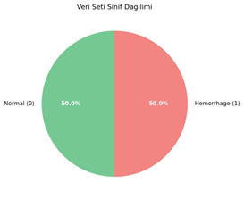

Sınıfların %50/%50 dengeli olması, metrik yorumunu daha güvenilir kılar ve sınıf dengesizliğinden kaynaklanan yanlılığı en aza indirir.

**Beklenen dosya yapısı:**

```
project/
├── labels.csv          # id, hemorrhage kolonları
└── head_ct/            # 000.png, 001.png, ...
    ├── 000.png
    ├── 001.png
    └── ...
```

`head_ct/` klasöründen örnek görseller:

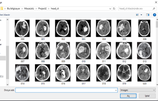

---

## 🧪 Veri Hazırlama ve Leakage Önleme

Veri seti **%70 train · %15 validation · %15 test** olarak ayrıldı. Ayrımda iki kritik teknik birlikte uygulandı:

- **Stratified split:** Her sette sınıf dağılımı (Normal/Hemorrhage oranı) korunur.
- **Group split:** `patient_id` gibi bir grup kolonu varsa, **aynı hastaya ait kesitler farklı setlere düşmez**. Bu, modelin "hastayı" değil "kanamayı" öğrenmesi açısından kritiktir; aksi halde test seti aşılmış (data leakage) olur.

Ayrım sonrası sınıf dağılımının korunduğu görülmektedir:

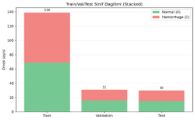

Her üç sette de Normal/Hemorrhage dengesi korunmuştur — bu, raporlanan metriklerin deneysel güvenilirliğini artırır.

---

## 🔄 Augmentation Stratejisi

> **Kritik nokta:** Augmentation **yalnızca train setine** uygulanır. Validation ve test setlerinde sadece `Resize + Normalize` vardır. Bu sayede test ölçümleri kararlı ve tekrarlanabilir kalır.

Veri seti küçük (n=200) olduğundan, augmentation modelin ezberlemek yerine **genelleme** öğrenmesine yardım eder.

<details>
<summary><b>📋 Train setinde uygulanan tüm dönüşümler (tıkla)</b></summary>

| Teknik | Amaç |
|---|---|
| `Grayscale(num_output_channels=3)` | Tek kanallı BT'yi 3 kanallı modele uyarlar |
| `Resize + RandomCrop` | Pozisyon varyasyonu |
| `RandomRotation(15°)` | Küçük açı dönüşümleriyle robustluk |
| `RandomHorizontalFlip(p=0.5)` | Sol-sağ varyasyon |
| `RandomAffine` | Hafif kaydırma ve zoom |
| `ColorJitter` | Cihaz/çekim koşulu farklarını taklit |
| `RandomApply([GaussianBlur], p=0.2)` | Bulanıklık senaryoları |
| `RandomErasing(p=0.2)` | Kısmi bölge kaybı/artefakt |
| `Normalize(ImageNet)` | Ölçek standardizasyonu |

</details>

---

## 🧬 Model Mimarileri

İki yaklaşım aynı veri pipeline'ı üzerinde karşılaştırıldı:

### 1️⃣ ConvNeXt‑Tiny (Transfer Learning)

- ImageNet ön‑eğitimli ağırlıklarla başlatılır.
- `torchvision.models.convnext_tiny` üzerinden yüklenir.
- Son sınıflandırıcı katman 2 sınıfa uyarlanır.
- ✅ Önceden öğrenilmiş gorsel temsiller sayesinde küçük veri setlerinde güçlü.
- ❌ Daha fazla parametre, daha yüksek bellek/hesap maliyeti.

### 2️⃣ CustomHeadCTCNN (Sıfırdan)

- `Conv → BatchNorm → ReLU → MaxPool` blokları
- `AdaptiveAvgPool → Dropout → Linear` çıkış
- ✅ Hafif, mimari kontrolü tamamen elimizde.
- ❌ Sıfırdan öğrendiği için daha fazla veriye ihtiyacı var; küçük veride genelleme zayıflıyor.

---

## ⚙️ Eğitim Stratejisi

| Bileşen | Seçim |
|---|---|
| **Loss** | `CrossEntropyLoss` |
| **Optimizer** | `AdamW` |
| **Scheduler** | `CosineAnnealingLR` |
| **Early stopping** | Validation loss izlenir, patience aşılırsa durdur |
| **Checkpointing** | En iyi val loss'lu ağırlıklar kaydedilir |
| **HPO** | **Optuna** ile `lr`, `batch_size`, `max_epochs` araması |

**Optuna ile bulunan en iyi parametreler:**

```json
{
  "lr": 0.000327,
  "batch_size": 32,
  "max_epochs": 35
}
```

**Eğitim eğrileri (Train/Val Loss & Accuracy — her iki model):**

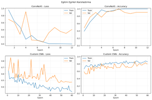

- ConvNeXt: hızlı yakınsama, val loss'ta düzgün düşüş, val accuracy yüksek bir platoya oturuyor.
- Custom CNN: train iyileşse de val tarafında dalgalı seyir → küçük veri setinde sıfırdan öğrenmenin tipik problemi.

---

## 🏆 Sonuçlar ve Karşılaştırma

### 📈 Metrik Karşılaştırması

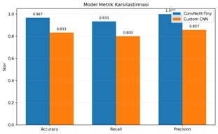

| Metrik | **ConvNeXt‑Tiny** | **Custom CNN** |
|---|---|---|
| Accuracy | **0.9667** | 0.8333 |
| Recall (Hemorrhage) | **0.9333** | 0.8000 |
| Precision | **1.0000** | 0.8571 |
| TN / FP / FN / TP | 15 / 0 / 1 / 14 | 13 / 2 / 3 / 12 |

### 🔥 Confusion Matrix — ConvNeXt‑Tiny

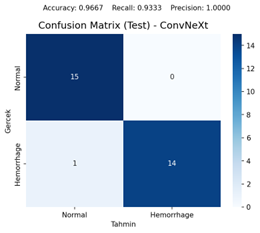

ConvNeXt yalnızca **1 kanama** vakasını kaçırdı, **hiç yanlış alarm üretmedi**. Klinik güvenlik perspektifinden güçlü bir profil.

### 🔥 Confusion Matrix — Custom CNN

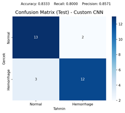

Custom CNN tarafında hem **2 false positive** (yanlış alarm) hem **3 false negative** (kaçırılmış kanama) görülüyor — sıfırdan öğrenmenin küçük veride kısıtlılığı belirgin.

### 🧠 Yorum

- **Transfer learning, az veride çok belirgin bir avantaj sağladı.** ImageNet'ten gelen düşük seviye görsel filtreler tıbbi görüntüde de işe yaradı.
- ConvNeXt'in **Recall = %93.3 ve Precision = %100** kombinasyonu, klinik öncelikler (kaçırmamak + yanlış alarm vermemek) açısından dengeli.
- Custom CNN ile augmentation iyileştirmeleri recall'u yükseltti ama ConvNeXt seviyesine ulaşamadı.
- Bu sonuçlar **tek bir split** üzerinden raporlandı; daha sağlam bir genelleme değerlendirmesi için cross‑validation desteklenmeli.

---

## 🖥️ Grafiksel Arayüz (GUI)

CustomTkinter ile modern bir dark dashboard tasarlandı. Kullanıcı bir BT görüntüsünü yükleyebilir, model seçebilir, tahmini ve Grad‑CAM görselini birlikte alabilir.

### Ana Ekran (boş durum)

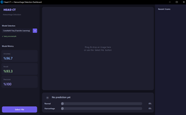

- **Sol panel:** Model seçim dropdown'u (ConvNeXt / Custom CNN) + metrik kartları (Accuracy, Recall, Precision)
- **Orta panel:** Görüntü alanı + drag‑and‑drop desteği
- **Alt panel:** Normal / Hemorrhage olasılık barları
- **Sağ panel:** Son taranan görüntülerin geçmişi (thumbnail + sonuç)

### ConvNeXt + Grad‑CAM Çıktısı (Hemorrhage)

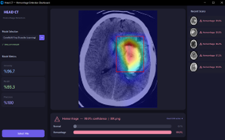

Model BT kesitini **%96.7 confidence** ile `Hemorrhage` olarak sınıflandırdı. Isı haritası kanama bölgesini net biçimde işaretliyor; **kırmızı bounding box** yüksek aktivasyon alanını çevreliyor. Bu görsel, açıklanabilirlik (XAI) bileşeninin pratik karşılığıdır.

### Custom CNN Çıktısı

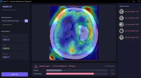

Aynı arayüz, model "Custom CNN"e alındığında — GUI **model‑agnostic** olduğundan farklı modellerin çıktıları aynı format altında karşılaştırılabilir.

### Geçersiz Görüntü Kontrolleri

GUI ayrıca **non‑CT görüntüleri** filtrelemek için kontroller barındırır:

- Renkli görüntü tespiti (kanal farkı)
- Parlaklık aralığı kontrolü
- Kontrast aralığı kontrolü

---

## 🚀 Kurulum ve Kullanım

### 1. Ortam Hazırlığı

```bash
cd Project2
python -m venv .venv
# Windows
.venv\Scripts\activate
# macOS / Linux
source .venv/bin/activate

pip install -r requirements.txt
```

### 2. Model Eğitimi

**ConvNeXt-Tiny (Optuna ile):**

```bash
python train.py --model convnext_tiny --optuna --trials 12 --patience 7 --out best_convnext.pth
```

**Custom CNN:**

```bash
python train.py --model custom --lr 1e-3 --batch-size 16 --epochs 60 --patience 5 --out best_custom.pth
```

### 3. Test Değerlendirmesi

```bash
python evaluate.py --checkpoint outputs/checkpoints/best_convnext.pth \
                   --cm-out outputs/plots/cm_convnext.png \
                   --report outputs/convnext_metrics.txt

python evaluate.py --checkpoint outputs/checkpoints/best_custom.pth \
                   --cm-out outputs/plots/cm_custom.png \
                   --report outputs/custom_metrics.txt
```

### 4. GUI'yi Başlatma

```bash
python gui.py
```

<details>
<summary><b>📦 Kullanılan kütüphaneler ve görevleri (tıkla)</b></summary>

| Kütüphane | Görevi |
|---|---|
| `torch`, `torchvision` | Model tanımlama, eğitim, GPU, ConvNeXt |
| `numpy`, `pandas` | Sayısal işlemler, `labels.csv` |
| `scikit-learn` | Split, metrikler, confusion matrix |
| `matplotlib`, `seaborn` | Eğitim eğrileri, ısı haritaları |
| `Pillow`, `opencv-python` | Görüntü I/O, Grad‑CAM overlay |
| `optuna` | Hiperparametre optimizasyonu |
| `customtkinter`, `tkinterdnd2` | Modern dark GUI + drag‑and‑drop |
| `fpdf2` | Çalışma raporu PDF üretimi |

</details>

---

## ⚠️ Sınırlamalar

- **Veri büyüklüğü kısıtlı (n=200).** Genelleme istatistiği için daha geniş kohortlar gerekir.
- **Tek‑split raporlama.** Varyans analizi için cross‑validation eklenmeli.
- **2D yaklaşım.** Volumetrik (3D) bağlam doğrudan kullanılmıyor; bitişik kesitlerin sağladığı bilgi atılıyor.
- **Dış doğrulama yok.** Bağımsız kurumlardan gelen veride performans test edilmedi.
- **Klinik kullanım için değildir.** Çalışma araştırma/eğitim odaklıdır.

---

## ✅ Sonuç

Bu projede beyin BT kesitlerinden intrakraniyal kanamayı tespit eden uçtan uca bir derin öğrenme sistemi başarıyla hayata geçirildi. Veri pipeline'ı, modelleme stratejileri, hiperparametre optimizasyonu ve test değerlendirmesi tutarlı bir bütün olarak yürütüldü.

- **Transfer learning üstünlüğü:** ConvNeXt‑Tiny, küçük ve dengeli tıbbi veri setinde Custom CNN'i belirgin biçimde geçti.
- **Açıklanabilirlik:** Grad‑CAM, modelin karar verirken odaklandığı bölgeleri görsel olarak doğrulanabilir kıldı.
- **Kullanılabilirlik:** Modern GUI, hem teknik hem sunum açısından tamamlanmış bir prototip ortaya koydu.

Sonraki adımlar arasında **cross‑validation**, **3D yaklaşım**, **dış veri ile validasyon** ve **ensemble modeller** öne çıkmaktadır.

---

## 👥 Yazarlar

Düzce Üniversitesi — Bilgisayar Mühendisliği

| | |
|---|---|
| **Eren Çetin** |  
| **Ensar Celil Avcı** | 
| **Emre Samet Eroğlu** |


<p align="center">
  <sub>📌 Bu proje yalnızca <b>araştırma ve eğitim amaçlıdır</b>. Klinik tanı veya tedavi kararları için kullanılamaz.</sub>
</p>
